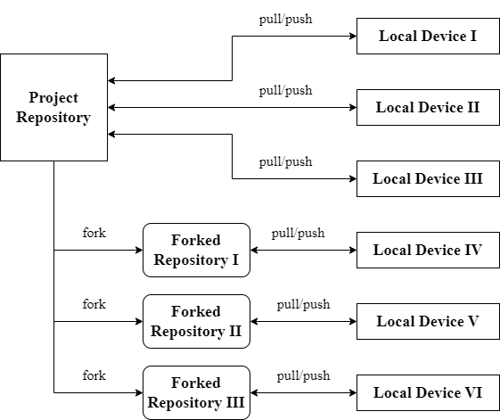

This week, [@Shenghan0329](https://github.com/Shenghan0329), [@rufaida99-k](https://github.com/rufaida99-k), and I started working on an open source Firefox add-on project called [YouTube Interface Customizer](https://github.com/ossd-s23/YouTube-Customizer), which allows users to customize their YouTube webpage (hide undesired elements, change color themes, modify layout, etc.), and this is my very first open source project as well as my very first experience with Javascript.

<!--more-->

## [Git Activity](https://github.com/ossd-s23/git_intro_activity)

Although I've been working with Git and GitHub for quite a long time, I have only worked on individual projects or with a few of my classmates. Therefore, my routine is just to clone the project to my local device, make commits, and pull and push each time I want to upload my modifications to GitHub.

However, I have never forked a repository before. In the git activity, I learned about the whole process of forking and working on the forked repository, as well as pulling the latest changes from the original repository through the upstream to the forked one. The workflow looks like follows.

## [YouTube Interface Customizer](https://github.com/ossd-s23/YouTube-Customizer)

Next I'm going to talk about YouTube Interface Customizer, my first open source project. The first obstacle that came was my unfamiliarity with Javascript. Since my teammates were busy during the week and I wanted to start early, I decided to start building a framework so that during the weekend we could work together more smoothly. I based the project on the structure of [`beastify`](https://developer.mozilla.org/en-US/docs/Mozilla/Add-ons/WebExtensions/Your_second_WebExtension), then I read through a bunch of documents while I was trying to figure out what to do. I also looked through some other GitHub repository of Firefox extensions and learned from them. Finally, I was able to finish a framework with a formatted popup window and part of the customization functionalities.

As the weekend came, my teammates and I had several meetings on what to do next. Basically we needed to add more funtionalities, beautify the interface, prepare for the presentation, and work on `README.md`, `CONTRIBUTING.md`, etc. Through the meetings we had a clear division of labor, so our collaboration went quite smoothly.

There were indeed conflicts. For instance, [@rufaida99-k](https://github.com/rufaida99-k) modified the layout of the popup window, but we did not agree on whether we want to adopt those changes. We solved this conflict in an additional meeting by talking about which part of the modification we wanted to keep and which part we wanted to discard. Finally we managed to push those changes with everyone's agreement. Another challenge was the merge conflicts, which often happened when one of us made large changes to the organization of code. In this case, we would always remind each other in advance, and we figured out that it was a good behavior to always pull and merged the changes before starting to work on the project, so that there would not be too many conflicts to deal with.

Overall, our project is proceeding smoothly and please look forward to our presentation next week.

### [MDN Web Docs](https://developer.mozilla.org/en-US/) Issue

This is a little bit of chit-chat. Last week when we were learning from scratch how to make Firefox extensions based on [Your first extension](https://developer.mozilla.org/en-US/docs/Mozilla/Add-ons/WebExtensions/Your_first_WebExtension) by MDN Web Docs. However, I found that the testing example it gave did not work on my browser. After a little bit of trial-and-error, I figured out that it was page redirection that led to the error. Therefore, I opened a [Github issue](https://github.com/mdn/content/issues/24248) to report this problem and prompt to add a note for the sake of further readers. It was closed this week by [@hamishwillee](https://github.com/hamishwillee), adopting my suggestion.

## Summary

I have talked about my gain from the Git activity and the progress of my team in the past week, including things that went well and the problems we faced. I have also mentioned an interesting issue I found in the MDN Web Docs. Finally, thank you very much for your meticulous reading and hope you enjoy it.
