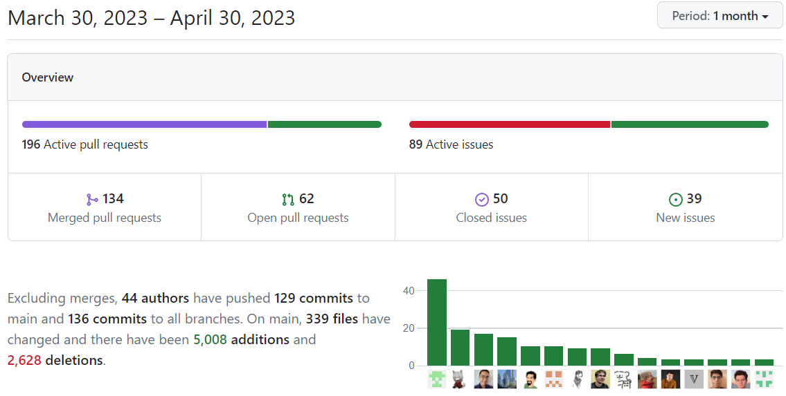

This week is our last week of making contributions to scikit-learn for our final project, because we will be one of the first groups to present on Monday. However, this will definitely not be the end of my open source contributions, since through this experience, I have found myself really interested in this field.

<!--more-->

## Contribution Overview

Up till the end of this week, we have made 61 pull request to scikit-learn, which include 45 merged pull requests and the other 16 pending or under review. Personally I have made 23 merged pull requests, and became the #89 contributor in scikit-learn. We are also honored to appear togther on the GitHub insights page:

Our contributions are mainly about the maintenance issues, *i.e.*, automatic parameter validation as I have mentioned multiple times in my previous posts. But we have made enhancements, bug fixes, and documentation contributions as well. Overall, this experience really taught us a lot. Personally, through making these pull requests and talking with the maintainers, I learned about a lot of skills that I would not have obtained in a normal CS course such as unit testing. Also, I am now more familiar with git, and my ability of reading code and debugging large projects have improved.

I find myself really interested in making open source contributions, and given that many of my pull request are still under review, I will definitely keep updating and continue my journey of open source contributions.

## Preparing for Presentation

Making a presentations is, from my persepective, even harder than making open source contributions. It is hard to make the slides readable (since there are many things to include on every single page), and it is hard to organize the presentation structure in a reasonable way. We cannot paste our codes, and it is impossible to talk about every detail given the time limit and the large number of contributions we have made. After several rounds of discussion, we have finally decided which parts to include, and in which order will we present (though the structure is still a bit of strange, I think that's it).

We have rehearsed several rounds. In the first rehearsal, none of us were sure about what to say, so it was a mess. Then after some discussion and some practice, we made our second attempt, but it was almost 30 minutes (possibly due to influent English). We are still making changes and trying to be more concise, so as to deliver a well-organized and informative presentation to the class.

## Summary

In this blog post, I have summarized our open source contributions in the past one and a half months. It is indeed a pleasant and unforgettable experience. I have also briefly mentioned our progress regarding the upcoming presentation. To the class, hope you enjoy our presentation in advance. Finally, thank you very much for your meticulous reading and hope you enjoy it.
